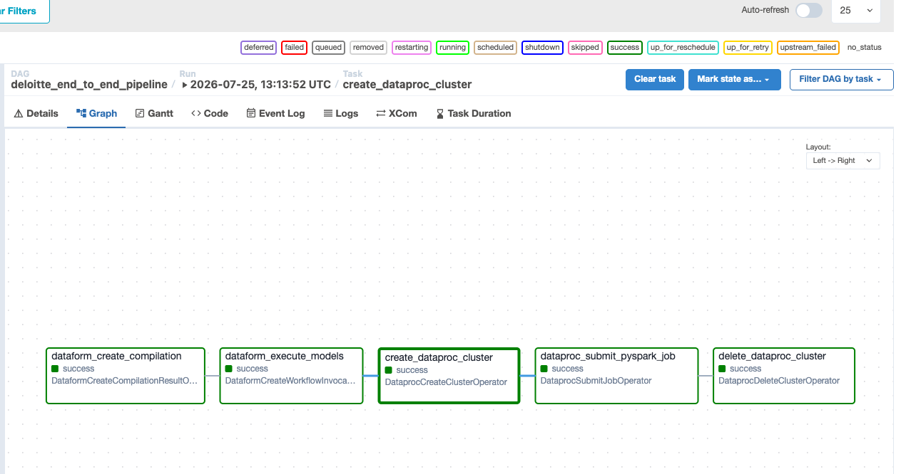
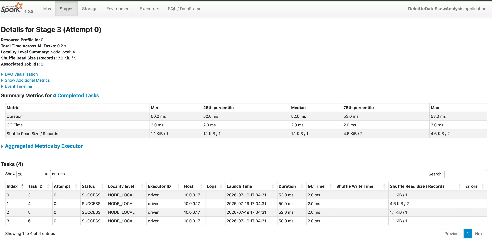

# Deloitte Data Engineering Home Assignment

This repository contains an end-to-end data pipeline built on **Google Cloud Platform (GCP)** using **Apache Airflow**, **Dataform**, **Google Cloud Dataproc**, and **PySpark** to handle BigQuery transformations and address data skewness.

---

## 🏗️ Architecture Overview

The pipeline orchestrates the following execution lifecycle:

1. **Dataform Compilation & Invocation:** 
   * Compiles and executes Dataform models directly in **BigQuery** to perform initial SQL transformations on raw datasets.
2. **Ephemeral Dataproc Provisioning:** 
   * Spins up a single-node Dataproc cluster (`e2-standard-2`) configured for PySpark jobs.
3. **PySpark Execution & Skew Handling (`spark_skew_analysis.py`):** 
   * Reads target tables directly from BigQuery via the BigQuery Connector.
   * Performs high-cardinality aggregation (`groupBy("city")`) to handle data skew and compute city address totals.
4. **Automated Resource Cleanup:** 
   * Deletes the Dataproc cluster upon pipeline completion or failure (`trigger_rule="all_done"`) to eliminate idle compute costs.

---

## 📊 Pipeline & Spark Execution Proof

### Airflow DAG Success

### Spark UI & Skew Analysis

---

## 📂 Repository Structure

* **`deloitte_pipeline_dag.py`** – Airflow DAG controlling the end-to-end workflow execution.
* **`spark_skew_analysis.py`** – PySpark job reading BigQuery tables, handling skewness, and performing aggregations.
* **`generate_and_load_data.py`** – Script for generating test datasets and staging them into BigQuery.
* **`composer_dag_complete.png`** – Proof of successful end-to-end DAG execution in Cloud Composer.
* **`spark_dashboard.png`** – Spark UI metrics and execution details.

---

## ⚙️ GCP Setup & Prerequisites

* **Google Cloud Composer / Airflow** with Dataform and Dataproc operators enabled.
* **GCS Storage:** Bucket staging PySpark scripts and BigQuery connectors.
* **IAM Roles:** BigQuery Data Editor, Dataproc Editor, and Storage Object Viewer permissions.
